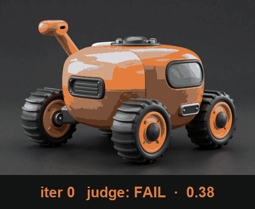
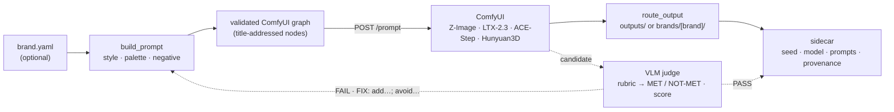

# Chimera


[](https://github.com/whartons/ComfyUI-Chimera/actions/workflows/ci.yml)
[](https://github.com/astral-sh/ruff)
[](https://codecov.io/gh/whartons/ComfyUI-Chimera)


> An **agentic toolkit for ComfyUI**: a **self-correction loop** that judges its own renders with a
> VLM and **iterates until they pass**, plus a hardened **MCP bridge** to drive ComfyUI from an AI
> assistant — over a **brand-aware, multimodal** core (image · video · audio · 3D) that also runs
> **fully standalone** from one CLI. Built and run end-to-end on an RTX 5090.


<sub>↑ A proper chimera — lion body, a goat head from the back, a serpent-headed tail, and ember-lit dragon wings — over an erupting volcano. Generated with the included [Z-Image workflow](workflows/templates/brand-zimage-txt2img.json) (`--variant base`) on an RTX 5090, straight out of ComfyUI.</sub>

Chimera wraps ComfyUI in an **agent layer**: it can **drive ComfyUI from an AI assistant** (a pinned,
audited MCP bridge) and **close the quality loop itself** — generate → VLM-judge → refine — so
generation isn't one-shot, it *iterates to a passing result*. It also runs **fully standalone**: a
pip-installable **`chimera`** CLI over a brand-aware, multimodal core, no assistant required. Public
and reusable — fork it, take what's useful. Developed on an RTX 5090 but written to help anyone on
ComfyUI, especially **Blackwell (RTX 50-series)**.

**The headline, in motion — the loop correcting itself:**


<sub>↑ **One subject, one seed.** The VLM judge **fails** an off-brand render (glossy toy finish, 0.38), the loop folds its `FIX: add…; avoid…` directives back into the prompt, and the re-render **passes** (on-brand tactical armor, 0.92) — generate → judge → refine, no human in the loop. The subject never changes; what gets corrected is the *brand*. It runs **brandless** too — the same loop against a *subject + quality* rubric (e.g. correcting a chimera that's missing its serpent-headed tail). See [`modules/agent/self-correction.md`](modules/agent/self-correction.md).</sub>

## ✅ What's here today (tested, not vapor)

- **🤖 An agent self-correction loop** *(the headline)* — Chimera doesn't just generate once, it
  *iterates to a passing result*: build a rubric (brand-specific, or a general subject + quality bar)
  → generate → a **VLM judges the output against the rubric** → unmet criteria are fed back into the
  prompt → regenerate until it passes or hits an
  iteration cap. A **judge-agnostic, model-free core** (unit-tested, no GPU) with two interchangeable
  backends: a **headless local Qwen2.5-VL-7B** judge, and an **assistant multi-judge-consensus** pass.
  Live-validated end-to-end. See [`modules/agent/self-correction.md`](modules/agent/self-correction.md).
- **🔌 Drive ComfyUI from an AI assistant** — a **pinned, security-audited** [MCP bridge](modules/agent/)
  exposes pipeline actions so an assistant (e.g. Claude) can run ComfyUI for you, with **per-tool
  approval gates** on the dangerous tools. The self-correction loop + the bridge are the two halves of
  the "agentic" story.
- **🎛️ …or run it standalone — one CLI, four modalities** — no assistant *and no brand* needed:
  `chimera image --subject "..."` just works (→ `outputs/`). The **`chimera`** command drives **image,
  video, audio, and 3D** through a shared core (prompt → validated graph → ComfyUI → routed output);
  **`--brand` is an opt-in layer** (see below). Every graph was built from live node schemas and run
  end-to-end on a 5090.
- **🩺 Preflight, updates + onboarding** — **`chimera doctor`** checks ComfyUI reachability, installed
  node packs, and your models *before* a multi-minute render; **`chimera update-check`** reports what's
  outdated (the repo, ComfyUI, pip deps, the pinned node packs) without breaking the pin-and-audit
  policy; **`new-brand`** + **`lint`** scaffold and validate a brand.
- **🔁 Reproducible by construction** — every render writes a schema-versioned **sidecar** JSON with a
  **provenance** block (resolved model + seed + the *actual* graph prompts, plus the ComfyUI version,
  pipeline git commit, and a structural graph signature). `chimera replay <sidecar>.json` re-runs the
  *identical* render.
- **[⚡ RTX 50-series / Blackwell tuning guide](docs/BLACKWELL-TUNING.md)** — the part most people get
  wrong. cu130 to unlock comfy-kitchen's FP4 kernels, SageAttention, `--fast`, NVFP4 — with **measured
  numbers** (FLUX.2: **8.4 s vs 22.7 s, a 2.7× speedup at equal quality** on a 5090) and the
  non-obvious **`Comfy.Server.LaunchArgs`** trick for passing flags to ComfyUI **Desktop**.
- **[🎨 Brand Kits — an optional layer](brands/)** — when you *want* consistency, point `--brand` at a
  folder of reference art + a YAML "brand brain" and every render comes out **on-brand** (prompt
  injection + alpha-exact logo overlay + product re-render + optional LoRA), routed to a per-brand
  folder. Entirely opt-in — the tool generates fine without it. The *pattern* is public; your brand
  data stays gitignored. See [`modules/image/brand-kits.md`](modules/image/brand-kits.md).

**315 GPU-free unit tests** (mocked ComfyUI client) keep the core green without a GPU — run on every
push via cross-platform CI (Linux + Windows).

## 🔭 How it works

One render is a straight pipeline; the **self-correction loop** wraps a feedback edge around it
(dotted below) — the judge either accepts the candidate or folds its `FIX` directives back into the
prompt and regenerates.



The full dependency/stack inventory (Python · ComfyUI · pinned node packs · MCP · models · CI · host)
is in **[`docs/STACK.md`](docs/STACK.md)**.

## 🧩 Modules
| Module | What it does | Status |
|--------|--------------|--------|
| [`agent`](modules/agent/self-correction.md) | **Self-correction loop** (generate → VLM judge → refine) | ✅ |
| [`agent`](modules/agent/) | **MCP bridge** + security model — drive ComfyUI from an assistant | ✅ |
| [`image`](modules/image/) | Z-Image (default) · FLUX.2 (secondary) — txt2img / logo / product · `--upscale` | ✅ |
| [`video`](modules/video/) | LTX-2.3 image-to-video + native synced audio · `--upscale` | ✅ |
| [`audio`](modules/audio/) | ACE-Step (music) · HunyuanVideo-Foley (video → SFX) | ✅ |
| [`threed`](modules/threed/) | Hunyuan3D 2.1 image → mesh (GLB / STL / OBJ) | ✅ |

## 🏗️ Architecture / engineering highlights

The parts an engineer (or hiring manager) might want to see:

- **The agent loop is a clean abstraction.** `run_loop` depends only on a `Judge` interface, a
  `PromptExpander` interface, and an injected `generate` callable — so the whole generate→judge→refine
  loop is **fully unit-testable with no ComfyUI, no GPU, no model**, and the local-VLM and
  assistant-consensus backends slot in behind the same seam.
- **One brand-aware core, per-modality fillers.** `manifest → prompt → validated graph → ComfyUI →
  routed output` is shared; each modality plugs in a small "filler" that builds its API-format graph.
  Nodes are addressed by a **stable `_meta.title`, not numeric id**, so re-saving a graph in ComfyUI
  can't break the fillers. Each filler **owns its model/upscaler resolution**, so the sidecar can never
  drift from the graph that actually ran.
- **Reproducibility is a first-class feature.** Schema-versioned sidecars capture the *resolved* inputs,
  the *actual* graph prompt/negative, and a provenance block (ComfyUI version, pipeline git commit,
  structural graph signature); `replay` reconstructs the run; an `agent-run` sidecar is explicitly
  marked so it can't be mistaken for a replayable render.
- **Third-party code is treated as untrusted.** The MCP server and every custom node pack are
  **read, adversarially audited, and pinned to an exact version or commit** before adoption, with
  per-tool approval gates on the dangerous tools — never `@latest`.
- **Tested without a GPU, on every push.** 315 tests run against a mocked ComfyUI client (graph-building,
  routing, sidecar, replay, scaffolder, doctor, and agent-loop logic), linted with **ruff** and packaged
  as an installable CLI — all verified by **CI on Linux + Windows**.

## ⚡ Use it — install once, then `chimera`

```bash
pip install -e .     # editable install; gives you the `chimera` command (+ python scripts/generate.py still works)
chimera doctor       # preflight: ComfyUI reachable? node packs + models installed?
```

**Brandless — no setup, just generate** (output → `outputs/<media>/`). `--brand` is **optional**:

```bash
chimera image --subject "an armored rover"                  # Z-Image txt2img (--variant base|turbo; --model flux2… for FLUX.2)
chimera image --subject "a chrome emblem" --upscale         # 4× ESRGAN
chimera video --from-image start.png --subject "rolls forward, dust"   # image→video + synced audio
chimera audio --mode music --subject "logo sting"           # text→stinger
chimera 3d    --from-image rover.png --format stl           # image→mesh (glb|stl|obj)
# asset args (--from-image / --asset / --from-video) take a direct file path when brandless
```

**Add `--brand` for on-brand output** — style/palette injection, logo overlay, product re-render,
optional LoRA, and per-brand output routing:

```bash
chimera image --brand <brand> --mode txt2img --subject "an armored rover" --watermark
chimera image --brand <brand> --mode product --asset rover.png          # img2img restyle into a scene
chimera audio --brand <brand> --mode foley --from-video clip.mp4 --subject "tires on gravel"
```

Brandless outputs land in `outputs/<media>/`; with `--brand` they route to
`brands/<brand>/outputs/<media>/` — each with a reproducibility sidecar, **moved** (never duplicated).
The opt-in `--watermark` composites the brand logo in-graph (needs a brand; off by default).

### 🤖 Or let it correct itself
`--brand` is **optional** here too — brandless judges subject + quality (a general QA gate); add a
brand to enforce its style/palette/negative.
```bash
# brandless: general "is this actually X, and is it sharp/clean?" gate (output → outputs/)
python scripts/agent/auto_generate.py --subject "an armored rover" \
    --comfy-output-dir <comfy_output_dir>   # generate → local VLM judge → refine, until it passes
# add --brand <brand> to enforce a brand's style/palette/negative instead (output → brands/<brand>/outputs/)
```

## 🔁 Reproducibility & replay

Every output ships a `<output>.json` sidecar recording the resolved seed, model, prompt/negative, and
inputs — plus a `provenance` block (ComfyUI version, pipeline git commit, and a structural graph
signature) so an asset traces back to exactly what produced it. Re-run any render exactly:

```bash
chimera replay brands/<brand>/outputs/images/<name>.json   # [--seed N] to vary
```

It reconstructs the CLI inputs from the sidecar and re-derives the prompt through the same brand-aware
path — so with an unchanged `brand.yaml` you get the identical render.

## 🆕 Spin up a new brand

```bash
chimera new-brand <name>      # scaffold from brands/_template/ (your brand stays gitignored)
chimera lint --brand <name>   # validate brand.yaml + referenced assets before you render
chimera doctor --brand <name> # then preflight the runtime (ComfyUI, node packs, models)
```

### 🖼️ Example showcase — the `example-brand`
The tracked **[`example-brand`](brands/example-brand/)** (an engineering-framed demo brand, "Mercury
Tactical Systems") is generated entirely by the commands above:

| `txt2img` | `product` (img2img) | `logo` overlay |
|:---:|:---:|:---:|
|  |  |  |

…plus a [video clip](brands/example-brand/outputs/video/example-brand_i2v_42.mp4) (LTX-2.3, synced
audio), the same clip [re-foleyed](brands/example-brand/outputs/video/example-brand_foley_42.mp4) with
realistic SFX, a [music stinger](brands/example-brand/outputs/audio/example-brand_music_42.mp3), and a
[3D mesh](brands/example-brand/outputs/3d/example-brand_image_42.glb).

**Brand consistency across subjects** — the same brand "brain" drives a whole fleet (in
[`outputs/branded/`](brands/example-brand/outputs/branded/)):

| recon-drone | quadruped | sensor-tower | tracked-utility |
|:---:|:---:|:---:|:---:|
|  |  |  |  |

See **[`docs/CATALOG.md`](docs/CATALOG.md)** for the best free, locally-runnable models per modality
(with VRAM needs + sources), and **[`docs/SETUP.md`](docs/SETUP.md)** for install notes.

## Quickstart
1. Install **ComfyUI ≥ 0.24** ([`docs/SETUP.md`](docs/SETUP.md) — RTX 50-series wants the
   CUDA 12.8+/cu130 build; the local agent judge uses a core node added in 0.24).
2. **5090 owner?** Run the [tuning guide](docs/BLACKWELL-TUNING.md) — it pays for itself.
3. Install Chimera + download a module's models (e.g. [`modules/image/models.md`](modules/image/models.md)):
   ```bash
   git clone https://github.com/whartons/ComfyUI-Chimera && cd ComfyUI-Chimera
   pip install -e ".[dev]"          # the `chimera` CLI + test/lint tooling
   chimera doctor --brand example-brand   # confirm ComfyUI + models are ready
   ```
4. Try it on the demo brand, or scaffold your own:
   ```bash
   chimera image --brand example-brand --mode txt2img \
       --subject "an armored rover" --comfy-output-dir outputs
   chimera new-brand my-brand       # then edit brands/my-brand/brand.yaml + lint it
   ```

## Privacy model
Public repo, private work. **Tracked & shareable:** `workflows/templates/`, all `modules/`, docs,
scripts. **Gitignored:** `workflows/personal/**`, any `*.local.json`, real brands under `brands/`,
`outputs/`, `models/`, `.env`. Name any private workflow `*.local.json` and it's ignored anywhere.

## 🔒 Security & maintenance (third-party code)
The MCP server and the custom node packs run third-party code with your privileges, so Chimera treats
them as **untrusted-by-default** and keeps them on a short leash:

- **Pinned + audited — never `@latest`.** Each third-party dependency (the `comfyui-mcp` server, the
  Qwen-VL judge pack, the foley pack) is read through and adversarially audited before adoption, then
  pinned to an exact version or commit. A floating tag could change under you between runs; a pin can't.
- **Hardened launch.** `NPM_CONFIG_OMIT=optional` keeps optional tunnel / cloud / LLM-SDK dependencies
  off your machine entirely.
- **Per-tool approval gates.** The code-execution / process-control / destructive MCP tools force an
  explicit prompt on every call via [`.claude/settings.json`](.claude/settings.json); read-only and
  generation tools stay frictionless.

**Reusable takeaway:** if you adopt *any* community MCP server or node pack, pin it, audit it, gate the
dangerous tools, and re-scan on a cadence instead of tracking `@latest`. Reporting a vuln? See
[`SECURITY.md`](SECURITY.md). Contributing? See [`CONTRIBUTING.md`](CONTRIBUTING.md).

## Hardware
Developed on an RTX 5090 (32 GB), **cu130 / torch 2.10** reference build. Most things run on far less
via quantized (GGUF / NVFP4 / fp8) weights — see each module's `models.md`.

## License
MIT — see [`LICENSE`](LICENSE). Models are licensed separately; see
[`docs/CATALOG.md`](docs/CATALOG.md) for each model's terms.
