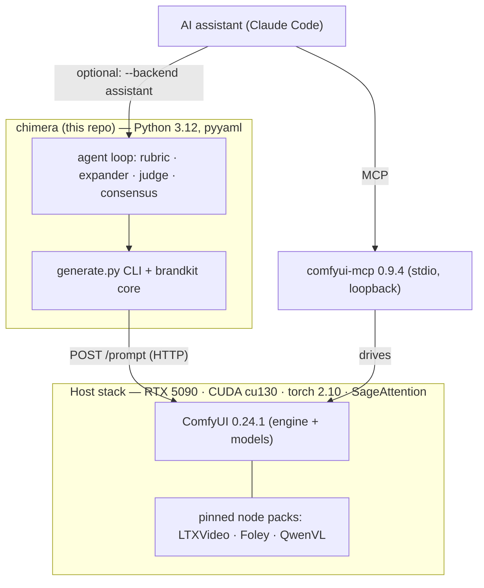

# Chimera — Stack & Dependency Inventory

One-glance inventory of everything Chimera is built and tested against: the language and Python
packages, the ComfyUI runtime, the pinned third-party node packs (with audit status), the MCP
bridge, the models, the CI actions, and the host stack. Versions/pins are the values **actually in
use** — the package keeps a deliberately tiny runtime footprint (the heavy lifting lives in ComfyUI).

> **Models** get their own, fuller catalog (files, HF repos, sizes, licenses, per modality):
> [`CATALOG.md`](CATALOG.md). **Runtime tuning** (cu130/FP4): [`BLACKWELL-TUNING.md`](BLACKWELL-TUNING.md).
> **Install**: [`SETUP.md`](SETUP.md).

---

## 1 · Language & Python packages
The `chimera` package (**v0.1.3**, MIT) is pure Python with one required runtime dependency.

| Package | Version | Scope | Used for |
|---------|---------|-------|----------|
| **Python** | `>=3.12` | runtime | everything |
| **pyyaml** | `>=6` | runtime (required) | parse `brand.yaml` manifests |
| **pytest** | `>=8` | dev | the GPU-free test suite (317 tests) |
| **ruff** | `>=0.10` | dev | lint — correctness rules (`select=["F"]`) |
| **pytest-cov** | `>=5` | dev | coverage gate (`--cov-fail-under=85`) |
| **pillow** | `>=10` | optional `[images]` | non-PNG logo sizing (`generate._image_size`) — graceful PNG-header fallback if absent |
| **av** (PyAV) | `>=12` | optional `[video]` | foley fps/duration auto-probe (`generate._probe_video`) — degrades to explicit `--fps/--duration` if absent |

`pip install -e ".[dev]"` for the full tooling; `[images]`/`[video]` are opt-in host-side helpers.

## 2 · ComfyUI runtime
| Component | Version | Notes |
|-----------|---------|-------|
| **ComfyUI** (Desktop) | **0.24.1** (reference) · **≥0.24.x** required | the generation engine. ≥0.24.x is required because the agent verdict-capture uses the **core** node `SaveImageTextDataSetToFolder` (added in 0.24.x). CUDA 12.8+ is the floor to drive Blackwell at all. |

## 3 · Third-party ComfyUI node packs (pinned + security-audited)
Every pack is **pinned by commit** (never `@latest`) and read-through audited before adoption; a
scheduled job re-scans upstream and the pin only advances after a clean result.

| Pack | Repo | Pinned commit | Used by | Audit verdict |
|------|------|--------------|---------|---------------|
| **ComfyUI-LTXVideo** | `Lightricks/ComfyUI-LTXVideo` | `229437c` | video (LTX-2.3 i2v + synced audio + latent upscaler) | safe-with-precautions — never use the cloud `GemmaAPITextEncode`; avoid the prompt-enhancer's `trust_remote_code` |
| **ComfyUI-HunyuanVideo-Foley** | `phazei/ComfyUI-HunyuanVideo-Foley` | `afd2960` | audio foley (video→SFX) | safe-with-precautions — only 3 nodes used; never run the bundled `cli.py`/`infer.py`/`gradio_app.py` (pickle-RCE) |
| **ComfyUI-QwenVL** | `1038lab/ComfyUI-QwenVL` | `fcd1ada` | agent local VLM judge (Qwen2.5-VL-7B) | safe-with-precautions — weights from the official Qwen repo only |

> Core-native (no pack needed): **Z-Image**, **ACE-Step 1.5**, **Hunyuan3D 2.1**, and the agent
> verdict-capture node all ship in ComfyUI core — only the three packs above are third-party.

## 4 · MCP bridge (assistant → ComfyUI)
| Server | Package | Version | Transport | Security posture |
|--------|---------|---------|-----------|------------------|
| **comfyui-mcp** | npm `comfyui-mcp` (`artokun`) | **0.9.4** | stdio, **loopback only** (127.0.0.1) | MIT; audited not-malicious. Per-tool **approval gates** on code-exec tools (`.claude/settings.json`); `NPM_CONFIG_OMIT=optional` disables the tunnel/cloud deps. Pinned + re-audited on bump. |

## 5 · Models (defaults — full inventory in [`CATALOG.md`](CATALOG.md))
| Modality | Default | Family / source |
|----------|---------|-----------------|
| Image | **Z-Image Turbo** (`z_image_turbo_nvfp4`) | Comfy-Org · Apache-2.0 · FLUX.2 is the secondary fallback |
| Video | **LTX-2.3 22B** (`dev-nvfp4`) | Lightricks · open weights |
| Audio — music | **ACE-Step 1.5 XL Turbo** | Comfy-Org · core-native |
| Audio — foley | **HunyuanVideo-Foley** | phazei · 48 kHz synced |
| 3D | **Hunyuan3D 2.1** | Comfy-Org · shape-only (PBR texturing platform-blocked) |
| Agent judge | **Qwen2.5-VL-7B-Instruct** | official Qwen · Apache-2.0 · ~15 GB FP16 |

Weights are **never committed** — referenced by name + source; see CATALOG for files, destinations, sizes, and licenses.

## 6 · CI / GitHub Actions
| Action | Version | Role |
|--------|---------|------|
| `actions/checkout` | `v6` | checkout |
| `actions/setup-python` | `v6` | Python 3.12 + pip cache |
| `codecov/codecov-action` | `v7` | coverage upload (**non-blocking**; `continue-on-error`) |
| **CodeQL** | default setup | security scanning |

**Required checks** on `main`: the two pytest matrix jobs — `ubuntu-latest` and `windows-latest`,
py3.12 (317 tests, `--cov-fail-under=85`). Codecov is **not** required; [`codecov.yml`](../codecov.yml)
makes the patch status informational. **Dependabot** watches `pip` and `github-actions`.

## 7 · Host / runtime stack (reference build)
| Component | Value |
|-----------|-------|
| GPU | RTX 5090 (32 GB VRAM) |
| CUDA | cu130 |
| PyTorch | 2.10 |
| Attention | SageAttention |
| Quantization | comfy-kitchen FP4 (NVFP4) path — the headline ~2.7× win |

Minimum to drive Blackwell at all: **CUDA 12.8+**. Per-module VRAM needs and quantized (GGUF /
NVFP4 / fp8) options are noted in each [`modules/<name>/`](../modules/) README. Don't assume a 5090.

---

### Update policy
A weekly scheduled job ([`.github/workflows/update-check.yml`](../.github/workflows/update-check.yml))
opens a **"🔄 Weekly update report"** issue flagging anything behind upstream; act on it via the
runbook [`UPDATING.md`](UPDATING.md). **Report-only — pins never auto-bump.**
- **Node packs / MCP**: pinned by commit/version, **re-audited before any bump** (same standard as the MCP bridge).
- **Python packages / GitHub Actions**: Dependabot proposes weekly bumps; CI must stay green.
- **ComfyUI**: `chimera update-check` / `doctor` against the running instance; smoke-render after a bump.
- **Models**: referenced by name + source in [`CATALOG.md`](CATALOG.md); **reviewed quarterly** for better options; weights, outputs, and caches are gitignored, never committed.
