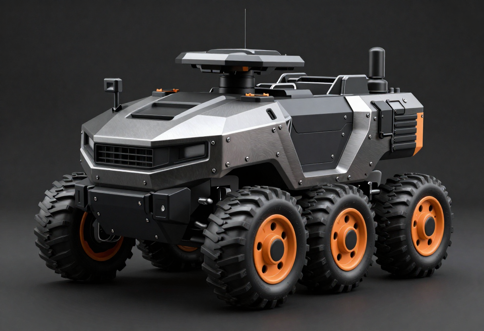

# Self-correction loop — generate → judge → refine

The self-correction loop turns Chimera from "**generate once**" into "**iterate to a
passing result**": render a candidate, judge it against a brand/brief rubric, feed the
unmet criteria back into the prompt, regenerate — until a candidate passes or a
max-iteration cap is hit. It is the orchestration layer that sits on top of Brand Kits
generation, distinct from the [MCP bridge](README.md) (which is the assistant→ComfyUI
transport).

## The shared core — `scripts/agent/`

A small, **model-free, judge-agnostic** core (unit-tested with no GPU/ComfyUI). It
reuses the existing `scripts/generate.py` filler/route path. Only the **winning**
render is recorded — with an *agent-run* sidecar (`kind: agent-run`) summarizing the
run (subject, iterations, pass/score, winning seed/prompt). That sidecar is a run
summary, **not** a replayable render sidecar: `generate.py replay` refuses it on the
`kind` discriminator. Per-iteration renders are routed into the brand folder but are
not individually sidecar'd, so the loop is **not** per-iteration replayable.

| Module | Responsibility |
|---|---|
| `rubric.py` | `Rubric` + `build_rubric(manifest, subject)` — composes a scorable checklist from the brand (subject, style, palette, negative). `rubric.as_prompt()` renders the numbered **MET / NOT-MET → PASS/FAIL → `score: 0-1`** instructions a judge follows. |
| `expander.py` | `PromptExpander` ABC + `TemplatedExpander` — wraps `build_prompt(manifest, subject)` for the on-brand `(positive, negative)`; given `prior_issues`, appends `". Emphasize and correct: <issues>"` so the next render corrects them. |
| `judge.py` | `Verdict(passed, score, issues)` + `Judge` ABC (`judge(image_path, rubric) -> Verdict`) + `parse_verdict(text)` — a robust free-text → `Verdict` parser (word-boundaried PASS/FAIL, clamped score, NOT-MET lines → issues; never raises). |
| `loop.py` | `run_loop(*, expander, judge, generate, manifest, subject, rubric=None, max_iters=4, seeds=None) -> LoopResult` — the heart. Judge-agnostic: `generate` and `judge` are **injected callables**. Threads prior issues forward; returns early on PASS, else the best-scoring candidate after the cap, with full per-iteration history. |

The judge's **PASS/FAIL verdict is authoritative** for stopping the loop — a single
PASS returns immediately. The `score` is *not* a threshold gate; it is used only to
**rank candidates** when the iteration cap is reached and the loop returns the
highest-scoring one. A mid-iteration render/judge failure is caught and recorded as a
failed candidate (score `0.0`, no image), so one bad iteration never aborts the run and
a failed candidate can never win.

The two pluggable seams are the **`Judge`** interface (how a candidate is scored) and
the **`PromptExpander`** interface (how a subject + prior issues become a prompt).
Everything else — the rubric, the loop, the generate path — is shared by both backends
below. `TemplatedExpander` is the V1 expander; an LLM-driven expander is a documented
future extension, not built.

## The two backends

Both drive the *same* core; they differ only in **who plays the `Judge`**.

| | **Assistant Workflow** | **Local standalone** |
|---|---|---|
| Judge | The assistant's own vision — **M independent passes, majority-PASS consensus** | A single **Qwen2.5-VL-7B** judge node |
| Driver | Claude Code's Workflow/subagent tooling (assistant in the loop) | Headless CLI: `scripts/agent/auto_generate.py --backend local` |
| Quality | **Highest** — multi-judge consensus catches subtle failure modes | Good — one strong VLM pass per candidate |
| Cost / deps | No API key, no extra model | ~15 GB VRAM VLM, fully **offline/unattended** |
| Status | **Built + proven** (live fail→pass captured below) | **Built + validated** (full loop ran live) |
| Recipe | [`../../workflows/agent/README.md`](../../workflows/agent/README.md) | `scripts/agent/auto_generate.py` |

**When to use which:**

- **Assistant Workflow** — highest-quality, subtle-correctness briefs (anatomy,
  layout, counts, "no X"), when you can keep the assistant in the loop. The multi-judge
  consensus is the strongest available filter. Recipe + the proven chimera-anatomy
  precedent: [`../../workflows/agent/README.md`](../../workflows/agent/README.md).
- **Local standalone** — unattended batches, scheduled jobs, or fully **offline** runs
  with no assistant present. Trades a touch of judging quality for autonomy.

### Multi-judge consensus — `ConsensusJudge`

The majority-vote consensus above is now a concrete, judge-agnostic `Judge`:
[`scripts/agent/judge.py`](../../scripts/agent/judge.py)'s `ConsensusJudge` wraps **N sub-judges**
and combines them — `passed` = a strict majority passed, `score` = the mean, `issues` = the
de-duplicated union of every sub-judge's unmet criteria (so the expander addresses *all* raised
concerns on the next iteration). A sub-judge that raises counts as a fail rather than crashing the
panel. The diversity comes from the judges you pass in (different VLMs/prompts, or an assistant
panel) — all behind the same `Judge` seam, so it drops straight into `run_loop`. Unit-tested in
[`tests/test_consensus.py`](../../tests/test_consensus.py).

### Local backend

> **Status: built + live-validated.** The full generate → judge → refine loop has run
> end-to-end: a Z-Image render judged by Qwen2.5-VL-7B against the auto-built brand
> rubric, returning `passed=True score=0.97`.

The local backend runs the **same** `run_loop` with a `Qwen2.5-VL` judge node in place
of the assistant's vision — see `scripts/agent/auto_generate.py`. The judge is
**Qwen2.5-VL-7B-Instruct** run **as a ComfyUI graph** (the same queue/`ComfyClient`
path every Chimera modality uses): `LoadImage → Qwen2.5-VL(prompt = rubric.as_prompt())
→ text`, then `parse_verdict()` turns that text into a `Verdict`. The expander is the
same deterministic `TemplatedExpander`, so a local run is brand-aware without any
assistant or API key.

**Invocation:**

```
python scripts/agent/auto_generate.py [--brand <brand>] --subject "<subject>" \
    --comfy-output-dir <ComfyUI output dir> [--max-iters N] [--seeds a,b,c]
```

`--brand` is **optional** — the same machinery does branded *and* general self-correction:

- **With `--brand`** — `build_rubric` adds the brand's style/palette/negative criteria, so the
  loop enforces brand conformance and the winner routes into `brands/<brand>/outputs/`.
- **Brandless** (omit `--brand`) — the manifest is the neutral `default_manifest()`, so the rubric
  collapses to just *"clearly depicts {subject}"* + *"high quality (sharp, well-composed, no
  artifacts)."* That's a general QA gate — reject blurry / wrong-subject / artifact-ridden renders —
  and the winner routes into the global `outputs/`. The judge, expander and loop are brand-agnostic;
  only the rubric's optional criteria differ.

`--comfy-output-dir` does double duty: it's both where finished renders route (into the brand
folder, or the global `outputs/` when brandless) **and** where the judge graph drops (and the judge
reads back) its verdict `.txt`.

### The judge & correction in action (real local-backend output)

The strict judge **enforces the brand** — it passes an on-brand render and rejects an off-brand one
(both judged live by Qwen2.5-VL-7B against the `example-brand` rubric):

| Judge **PASSED** — 0.95 | Judge **REJECTED** — 0.70 |
|:---:|:---:|
|  |  |
| dark tactical hull, legible "MERCURY-7", brand palette | *"playful, childlike… toy-like rather than rugged tactical-industrial"* |

The rubric is **strict** (overall PASS only if *every* criterion is MET) and asks the judge to attach
a structured fix to each miss — `FIX: add <…>; avoid <…>`. The expander consumes that directly:
`add` terms are emphasized in the next positive prompt; `avoid` terms are **stripped from the subject**
in the positive (Z-Image zeroes the text negative, so the positive is the real lever) and also pushed
to the negative for models that honor it (FLUX.2). See `scripts/agent/expander.py`.

**The judge evaluates every criterion and emits an actionable fix.** Verbatim from Qwen2.5-VL-7B on an
`example-brand` rover render:

```
1. MET — six wheels arranged in two rows of three, providing stability typical of military vehicles…
2. MET — robustly built with sharp angles consistent with industrial designs…
3. NOT-MET  FIX: add subtle highlights reflecting light off metallic surfaces;
            avoid overly smooth textures that might suggest plastic models rather than real metal
4. MET — dominant colors match those specified (#1c1f22, #2e3338)…
5. MET — clear details, no blurring…
```

That `FIX: add … ; avoid …` is exactly what the expander turns into the next prompt.

**It enforces the brand.** Given a deliberately off-brand *"glossy orange plastic toy rover,"* the
strict judge rejects it (and explains why), where the old lenient pass-bar would have rubber-stamped it:

```
NOT-MET — a playful, childlike appearance that aligns more closely with "toy-like" than with
          rugged tactical-industrial / precise engineering themes.
NOT-MET — lacks the specified palette colors like #1c1f22 …
Overall: FAIL   score: 0.7
```

…versus an on-brand render the same judge passes at **0.95–0.97**.

### A real fail→pass — the assistant consensus backend *correcting* an off-brand render

Enforcement is half the loop; the other half is **correction**. Below the loop is driven by the
**assistant consensus backend** — the agent's own vision, **M = 3 independent passes** combined by
[`consensus_verdict`](../../scripts/agent/judge.py) — against the `example-brand` rubric for subject
*"a six-wheeled exploration rover"*. **Same subject, same seed (7), same real pipeline; only the brand
correction changes** — one rover, taken from a glossy toy finish to on-brand tactical armor:

| iter 0 — consensus **FAIL · 0.38** (3/3 FAIL) | iter 1 — consensus **PASS · 0.92** (3/3 PASS) |
|:---:|:---:|
|  |  |
| a six-wheeled rover in **glossy candy-red/yellow toy** finish — fails *style*, *palette*, *avoids toy-like* | the **same six-wheeled rover** in gunmetal + matte-black tactical armor, rust accent — **every criterion MET** |

The first prompt was deliberately off-brand (*"a six-wheeled exploration rover vehicle, bright glossy
candy-red and sunny-yellow plastic bodywork, smooth rounded cartoonish toy styling, … pastel colors"*).
Each of the three vision passes marked it FAIL with a structured fix; `consensus_verdict` unioned their
issues, and the **real `TemplatedExpander`** turned them into the iter-1 prompt — stripping `glossy,
candy-red, sunny-yellow, toy, rounded cartoonish, pastel` from the subject and leading with *"Correct
the previous attempt — render strictly in the rugged tactical-industrial style…"* plus the emphasized
`add` terms (matte gunmetal, hard angular faceted panels, weathered, photoreal). Re-rendered at the
**same seed**, the consensus judge passed it 3/3. **The subject never changed — it is a six-wheeled
rover in both frames — so what you see corrected is the *brand*, not the object.** That is the loop
doing what it is for: **turning a genuine miss into an on-brand pass**, not merely rejecting.

One of the three passes for each frame, **verbatim** (the texts `consensus_verdict` parsed and combined
— same format the local 7B section above quotes, except here the judge is the agent's own vision, so
read the score as the agent's self-assessment, not a third-party metric):

```
# iter 0 — one of three FAIL passes
1. avoids toy-like/cartoonish: NOT-MET - unmistakably a glossy plastic kids toy.
   FIX: add rugged matte tactical hardware; avoid toy-like, glossy plastic, cheerful, rounded cartoonish
2. high quality (sharp, well-composed): MET - sharp and clean.
Overall: FAIL   score: 0.4

# iter 1 — one of three PASS passes
1. clearly depicts a six-wheeled exploration rover: MET - a six-wheeled armored rover, three wheels per side.
2. style matches rugged tactical-industrial, gunmetal, matte black, hard edges, photoreal: MET -
   angular faceted armored hull, photoreal hardware render.
Overall: PASS   score: 0.94
```

The headline **0.38 / 0.92** are the **mean of each frame's three self-assessed passes**
(`consensus_verdict` averages them); the per-pass scores above are the individual votes.

**Honest note on convergence — and which backend earns it.** Z-Image's base quality plus brand prompt
injection are strong enough that a *satisfiable* subject often passes on the **first** iteration, so a
dramatic fail→pass appears only when a render genuinely misses the brand (as above, where the first
prompt was deliberately off-brand). Reliability scales with the judge. The **assistant consensus
backend** earns that fail→pass cleanly — three independent vision passes yield a strict verdict and
precise, format-following fixes. The **autonomous local 7B** follows the structured-fix format only
*intermittently*, so it enforces the brand reliably but converges less consistently — the trade for
running unattended. Choose the tier per job: `--backend local` for hands-off batches, the opt-in
`--backend assistant` (agent in the loop) when you want the strongest correction.

### …and it works **without a brand**, too — correcting *content*, not style

Drop `--brand` and the **same loop runs brandless**: `default_manifest()` collapses the rubric to
*"clearly depicts {subject}"* + *"high quality"* (no style/palette criteria), and the expander's
correction carries **no brand lead** — just `"Correct the previous attempt. {subject}. Ensure these
are present: …"`. Here the subject is a **chimera** — *a lion's body, a goat's head rising from its
back, and a serpent-headed tail* — and the miss is **content**, not brand:

| iter 0 — consensus **FAIL · 0.59** (3/3 FAIL) | iter 1 — consensus **PASS · 0.91** (3/3 PASS) |
|:---:|:---:|
|  |  |
| lion body ✓ + goat head from the back ✓, but the **tail is an ordinary lion tail** — *"clearly depicts {subject}"* NOT-MET | the loop grew the **serpent-headed tail** — all three parts present, both criteria MET |

The judge's verbatim miss and fix (same `consensus_verdict`, brandless rubric):

```
1. clearly depicts the full chimera (lion body, goat head from the back, serpent-headed tail):
   NOT-MET - the tail is a plain tufted lion's tail, not serpent-headed.
   FIX: add a serpent's head at the tip of the tail, a scaled snake-headed tail; avoid plain lion tail
Overall: FAIL   score: 0.6
```

The expander folded that into `"…Ensure these are present: a serpent's head … at the tip of the
tail"` and the re-render grew the serpent tail. Note the **contrast with the branded demo above**: the
branded rubric corrected *style* (toy → tactical) because a brand *defines* a style; the brandless
rubric has no style criterion, so it corrected *content* (the missing tail) and left the rendering
style free (here it drifted photoreal → illustration — correct brandless behavior). Same machinery,
two jobs: **enforce a brand, or just make the render actually depict what you asked for.** Run it with
`python scripts/agent/auto_generate.py --subject "…" --comfy-output-dir …` (no `--brand`).

**How the verdict is captured:** the judge graph
(`workflows/templates/agent-vlm-judge.json`) runs Qwen2.5-VL via the
`AILab_QwenVL_Advanced` node and writes its text output to disk with the **core**
ComfyUI node `SaveImageTextDataSetToFolder` (`comfy_extras.nodes_dataset`), which lands
`agent_verdicts/<prefix>_00000.txt`; `LocalVLMJudge` reads that file (run-unique prefix,
brief retry for the FS flush) and feeds it to `parse_verdict()`. That save node is
`experimental` and ships in core ComfyUI — it is **not** a separate node pack — so it
requires **ComfyUI ≥ 0.24.x** (the QwenVL node pack remains the only third-party
dependency).

- **Model:** `Qwen2.5-VL-7B-Instruct` — FP16 ≈ **15 GB VRAM**, placed in
  `models/LLM/Qwen-VL/` (catalogued in [`../../docs/CATALOG.md`](../../docs/CATALOG.md)).
- **Node pack:** [`1038lab/ComfyUI-QwenVL`](https://github.com/1038lab/ComfyUI-QwenVL),
  installed and **security-audited this session** — verdict **SAFE-WITH-PRECAUTIONS**,
  **pinned at commit `fcd1ada`**. Re-scan before advancing the pin.

**VRAM / perf:** the 7B judge at FP16 fits a 32 GB card alongside an image model with
room to spare, but judging adds a VLM load + inference per candidate, so a multi-seed
batch is meaningfully slower than a plain generate. For lighter cards, a smaller VL
variant is the natural fallback (judging quality drops accordingly).

**Security posture:** weights come from the **official Qwen repo**
(`Qwen/Qwen2.5-VL-7B-Instruct`) only; the node pack is **pinned** (no `@latest`) at the
audited commit, consistent with the rest of Chimera's third-party-code policy (same
standard applied to the [MCP bridge](README.md) and the foley pack). Re-audit before
any pin bump.
